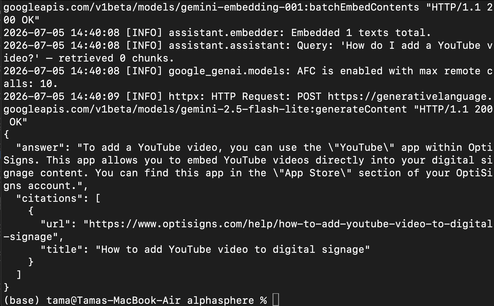
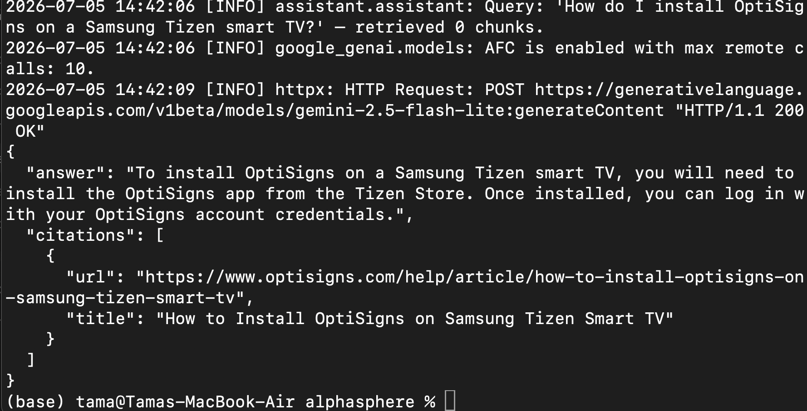

# OptiBot

Customer-support chatbot for OptiSigns.com. Scrapes support articles from Zendesk, builds a RAG knowledge base with Gemini embeddings + ChromaDB, and answers questions with cited article URLs.

## Setup

```bash
cp .env.sample .env
# Fill in: ZENDESK_SUBDOMAIN, ZENDESK_EMAIL, ZENDESK_API_TOKEN, GEMINI_API_KEY
pip install -r requirements.txt
```

## Run Locally

```bash
# Ingest articles into vector store (run once or daily)
python -m assistant.cli ingest

# Ask a question
python -m assistant.cli ask "How do I add a YouTube video?"

# Run full pipeline (scrape + ingest)
python main.py
```

## Daily Job Logs

Deployed on Railway as a midnight UTC cron job. State persisted to S3 between runs.

**Logs:** [https://railway.com/project/.../deployments](https://railway.com)

## Screenshot




